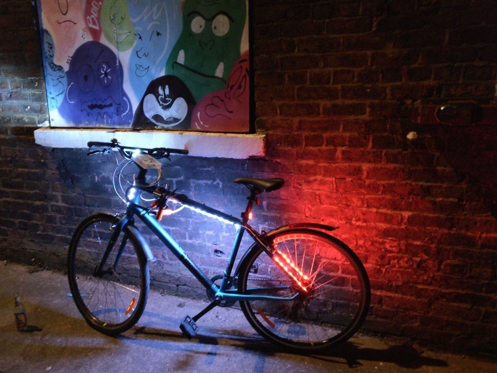

# DIY Arduino bicycle LEDs
Compatable with WS2812B, WS2813, NeoPixel LED strips.

## Read my blog post on it
http://conorriches.co.uk/diy-bicycle-lights-with-an-arduino ‎

## Summary 
Animated DIY bike lights - back, front and downlights.
